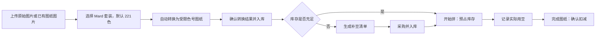

# 豆老庄｜产品需求文档（PRD）

## 1. 产品概述

**产品名称：** 豆老庄  
**产品定位：** 面向拼豆爱好者的图纸、库存与制作进度管理平台。用户可把图纸中的颜色和用量沉淀为可计算的数据，清楚知道“还剩什么、正在拼什么、缺什么豆子”。

**首期服务终端：** 微信小程序。PC Web 与移动 H5 不纳入首期，待验证核心闭环后再评估。  
**首期目标：** 完成“图纸导入 → 用豆统计 → 库存扣减 → 制作记录 → 缺豆清单”的闭环。

## 2. 用户与核心场景

| 用户 | 典型需求 | 产品价值 |
| --- | --- | --- |
| 拼豆新手 | 不清楚买了哪些颜色、做一张图还缺多少 | 自动生成缺豆清单，降低整理成本 |
| 日常创作者 | 同时做多张图，需要记录进度和已用材料 | 以图纸为单位管理制作状态与豆子消耗 |
| 重度收藏者 | 豆子数量、色号和图纸较多 | 按颜色与数量快速检索、筛选和排序 |

## 3. 产品范围

### 3.1 首期（MVP）

1. 账号：微信小程序授权登录，使用微信身份建立用户账户。
2. 豆子库：支持 Mard 24、48、72、96、120、221 色标准套装；默认以 221 色套装管理库存，记录 Mard 色号、当前数量、预警数量。
3. 图纸库：上传图片并自动转换为拼豆图纸；用户选择拥有的 Mard 套装限制可用颜色，默认使用 221 色；支持按 Mard 色号筛选。
4. 制作管理：图纸状态分为“待拼、正在拼、已完成”；记录开始、完成与实际用豆。
5. 库存联动：开始制作时预占/扣减用豆；完成后按实际用量确认；取消可回滚预占。
6. 补豆清单：汇总当前进行中或待开始图纸的缺口，并可勾选“已购买”。

### 3.2 暂不纳入首期

- 用户之间的图纸交易、社区、评论和私信。
- 手动新建图纸、手动填写图纸色表或 CSV 色表导入。
- 电商下单、物流与真实支付。
- 多人协作、工作室权限体系。

## 4. 信息架构

| 一级页面 | 核心内容 | 小程序交互形态 |
| --- | --- | --- |
| 首页/概览 | 库存总览、低库存、正在拼、缺豆摘要 | 卡片流 + 快捷入口 |
| 图纸库 | 图纸卡片、状态、颜色筛选、导入 | 筛选抽屉 + 卡片列表 |
| 图纸详情 | 预览、颜色用量、制作记录、状态操作 | 上预览、下统计，吸底操作栏 |
| 豆子库 | 库存、颜色、数量、预警、排序 | 紧凑列表 + 色卡选择器 |
| 补豆清单 | 缺口合并、来源图纸、购买状态 | 按 Mard 色号分组列表 |
| 我的 | 登录、同步、反馈 | 设置页 |

底部导航为：**概览、图纸库、豆子库、补豆、我的**。

## 5. 功能需求

### 5.1 豆子库

**字段**

| 字段 | 说明 | 必填 |
| --- | --- | --- |
| Mard 色号 | 从内置 Mard 221 色母色卡中选择，系统唯一标识 | 是 |
| Mard 色名 | 由色卡带出，用于搜索与展示 | 是 |
| 标准色值 | 对应 Mard 色卡的预置色值，仅用于色块展示，用户不可编辑 | 是 |
| 当前库存 | 可用颗数，整数且不小于 0 | 是 |
| 预警库存 | 低于或等于该值时提示补货 | 否 |
| 备注 | 收纳位置、批次等 | 否 |

**规则**

- 系统支持 Mard 24、48、72、96、120、221 色套装；221 色为默认套装和母色卡，较小套装均为其受限色号集合。
- 用户在“我的套装”中选择拥有的套装；图纸转换只使用该套装允许的色号，首次默认选择 221 色。
- 同一用户每个 Mard 色号仅有一条有效库存记录；较小套装只影响图纸可选色范围，不改变库存的色号口径。
- 默认按 Mard 色号展示；用户可切换按当前库存升序/降序排序。
- 库存变动必须生成流水，来源包括：手动盘点、图纸预占、完成确认、取消回滚、采购入库。
- 删除已有流水或被图纸引用的豆子时，改为“归档”，不直接物理删除。

### 5.2 图纸库与导入

**图纸状态：** `待拼`、`正在拼`、`已完成`、`已归档`。

**图纸卡片至少展示：** 封面、名称、成品尺寸/格数（如有）、颜色数、总用豆数、状态、最后编辑时间。

**唯一导入方式：上传图片并自动转换。** 用户可上传两类图片：

1. **已有拼豆图纸图片：** 例如他人分享的 PNG/JPG 图纸。系统识别其网格与颜色，按用户所选 Mard 套装转换并统计用量。
2. **原始图片：** 例如照片、插画或表情图。系统调用既有图纸转换算法，完成尺寸/格数处理、Mard 色号映射、网格图生成和用量统计。

转换前，用户可选择 `24 / 48 / 72 / 96 / 120 / 221 色`套装，默认 `221 色`。转换完成后进入“转换结果确认页”，展示原图、生成图纸预览、所用套装、成品格数、颜色数、总用豆数和逐色用量。用户可修改图纸名称、选择预设尺寸/格数或套装后重新转换并确认入库；首期不提供从零手工新建图纸或手工填写色表。

**筛选与排序**

- 按状态、创建时间、转换来源（原始图片/已有图纸）筛选。
- 按图纸中是否含某一 Mard 颜色筛选；颜色筛选采用标准色块 + Mard 色名/色号搜索。
- 支持按最近编辑、总用豆量、完成时间排序。

### 5.3 图纸详情与制作记录

图纸详情包含“概览、用豆表、制作记录、附件”四个区域。

- 用豆表展示：Mard 色块、色名/色号、计划用量、可用库存、已预占、缺口。
- 点击“开始拼”：状态变为正在拼，并按计划用量预占库存；不足部分形成缺豆项。
- 制作中可记录实际消耗，支持按颜色调整；不得使实际消耗小于 0。
- 点击“完成”：确认实际消耗，写入库存流水，状态变为已完成。
- 取消/回退到待拼：释放尚未确认的预占量；已确认消耗不可静默回滚，需通过“库存盘点”产生纠正流水。

### 5.4 补豆清单

- 自动汇总缺口：`图纸计划量 - 该颜色可分配库存`，同一种豆子合并展示。
- 每项展示 Mard 色块、色名/色号、建议购买量、关联图纸数量与名称。
- 支持只看“正在拼缺豆”、查看全部计划缺豆、按色号区间分组。
- 支持手动增减建议购买量、勾选已购买；勾选入库后，可一键将数量写入豆子库并保留采购记录。

### 5.5 概览页

首期展示四张摘要卡：库存豆子种类、低库存种类、正在拼图纸数、缺豆种类数；下方展示“继续拼”“低库存提醒”“最近图纸”。

## 6. 关键业务规则

1. **颜色标准与匹配：** Mard 221 色为系统母色卡；图纸转换必须限制在用户选择的 `24 / 48 / 72 / 96 / 120 / 221 色`套装集合内，默认 221 色。图纸、库存、预占和补货均以 `mard_color_code` 为唯一颜色键。算法可计算近似色，但不能输出母色卡外或套装外颜色。
2. **可用库存：** `当前库存 - 已预占数量`。同一份可用库存不能被多张正在拼图纸重复使用。
3. **统计口径：** 图纸“计划用量”来自图纸色表；“实际用量”来自完成确认；库存余额以库存流水计算为准。
4. **转换版本保护：** 用户重新转换时生成新的图纸版本；正在拼或已完成的版本不可被覆盖，已完成图纸的实际消耗不随新版本改变。
5. **服务端一致性：** 所有写操作以服务端为准；小程序网络失败时不写入本地待办，明确提示用户重试并刷新结果。

## 7. 核心用户流程

## 8. 验收标准（MVP）

- 用户上传一张图片并完成转换确认后，可在详情看到 Mard 色号、各色计划用量、库存和缺口。
- 当同一种豆子被两张“正在拼”图纸使用时，第二张图纸只能使用扣除预占后的可用库存。
- 图纸开始、完成、取消和手动盘点后，豆子库数量与库存流水可追溯且一致。
- 补豆清单能把多个图纸对同一 Mard 色号的缺口合并，且可追溯关联图纸。
- 小程序重新进入或下拉刷新后，图纸、库存和进度与服务端数据一致。
- 添加豆子、开始拼、查看缺豆、完成图纸等关键流程可单手操作，且每个库存变更均有明确反馈。

## 9. 指标与迭代建议

首期关注：激活用户完成首张图纸创建率、至少添加 10 种豆子的用户占比、图纸开始制作率、缺豆清单使用率、7 日留存。

二期可评估：PC Web 库存管理端、移动 H5 分享页、格子画布编辑器、图纸模板与分享、条码/称重盘点、扩展其他品牌色卡。
